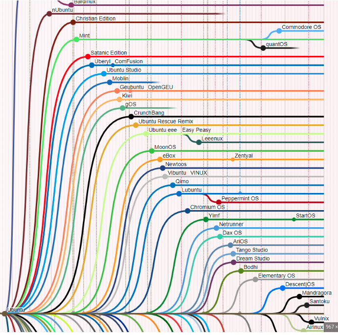
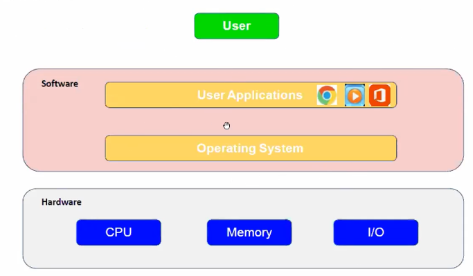
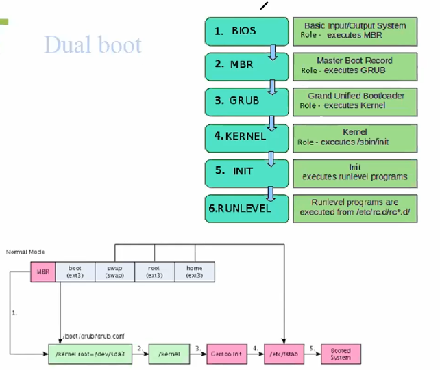
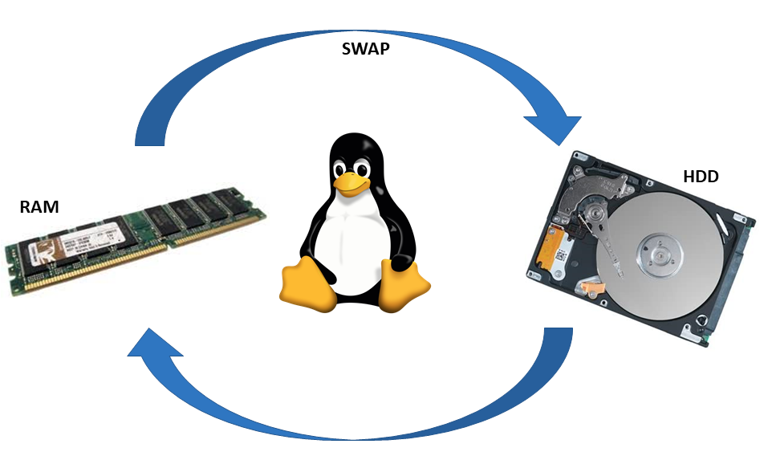
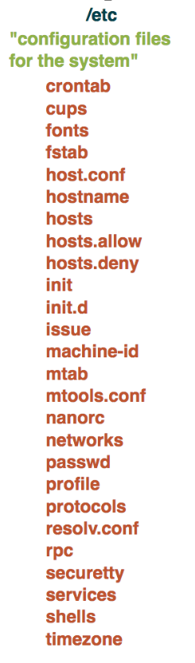
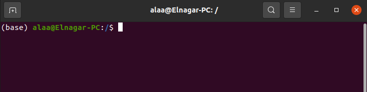
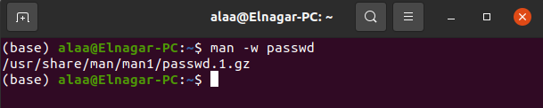
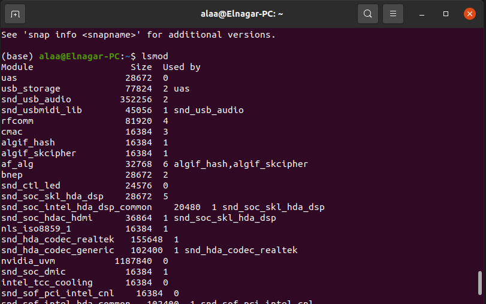
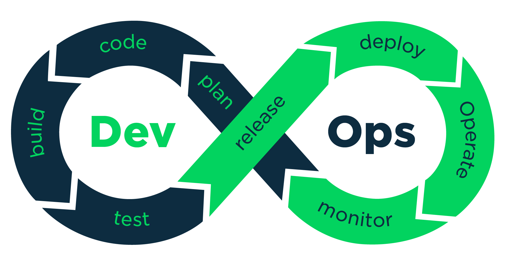
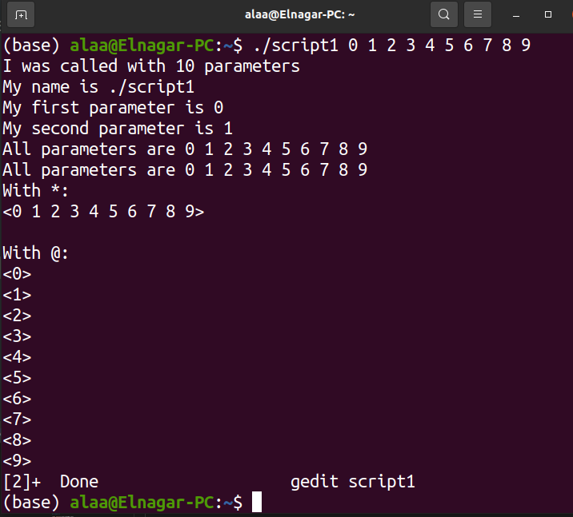

<span style="color:orange;font-weight:700;font-size:20px">

# Linux Adminstration 

</span>


## Outline

- History of Linux 
- Linux architecture 
- Usages of command line interface CLI 
- Shell scripting
- Process and Thread  
- Final project 

</span>

<span style="color:orange;font-weight:700;font-size:20px">

# History Of linux  

</span>

https://www.youtube.com/watch?v=ShcR4Zfc6Dw

## at 60's preparing of drivers was needed then application prepartion was needed. 
- 

- A needing of collecting drivers, schedulares was needed to prepare OS and share this data 
## UNIX OS was generated at 1970 based on the above with aid of Ken thompson and denis reche  as open source
<br >

- 

- At 1983 Linux become closed and Not open source for financial reasons 

- 1983 : Richard stallman Developed GNU 'Gnu not unix ' OS looks like UNIX 
## Richard stallman Kernal was not strong 


- 

## in 1991 Linus TRavaldos started working on Minix which was his teaching professor OS 

- 

- Linus started to prepare his own kernal based on minix os to adjust relation between Apps and HW

- 

- The need was based on coverage of the gab between both APP and Hardware through develoment of a kernal 

- 


- GNU Bought Linux from Linus and From here the pushing started 

<span style="color:orange;font-weight:700;font-size:20px">

## Linux usages : 

</span>

### Linux Runs NASA where  ``` NASA’s Martian helicopter runs Linux```
NASA switched from Windows to Linux years ago because of the favored performance reliability the Linux system offered. The recent deployment of the Astrobee robots to monitor and work under an International Space Station is proof enough that with Linux, the sky is not the limit.

- 


### Linux Runs Cars where  ```AGL Automotive Grade Linux ```
Which are distrubtion customized provide infotainment and more ,AGL is now being used for other automotive applications, including instrument cluster, heads-up-display (HUD), telematics/ connected car, advanced driver assistance systems (ADAS), functional safety, and autonomous driving systems.

- 

NASA switched from Windows to Linux years ago because of the favored performance reliability the Linux system offered. The recent deployment of the Astrobee robots to monitor and work under an International Space Station is proof enough that with Linux, the sky is not the limit.

- 

- In every where :  Airplans Systems, Servers, Mobile, ...
- Linux is open source so contrubution is occuring repeadly 

# Linux advantages 

https://upload.wikimedia.org/wikipedia/commons/b/b5/Linux_Distribution_Timeline_21_10_2021.svg

- Free, Safe, Roubust 
- Support a lot of devices STM, Arm 
- Support a lot of drivers 
- Huge number ofprogramming language 
- Highly modularized to be able to build something new 
- Low cost and ease of customization for Smartphones, GPS Devices ,Android ...
- lINUX kernal is free 

- 


</span>

<span style="color:orange;font-weight:700;font-size:20px">

## Linux Vs Embedded Linux 

</span>

- 


| Linux    |      Embedded Linux       |   |
|----------|:-------------:|------:|
| Used with general-purpose computers | Used with special-purpose computers/embedded systems |  |
| Runs on CISC (Complex instruction set computer) architecture based processors like x86 and x64 |    Runs on RISC(Reduced Instruction Set Computer) architecture based processors like ARM   |    |
| Need plenty of hardware support like hard disks, network cards, sound cards, graphics cards, etc. | Hardware support is limited to only the ones that are considered necessary for the project in hand |     |
| Resource and power-hungry hardware. |  More efficient and less resource hungry, usually run on batteries |  |
| Need BIOS/UEFI boot support. |  No BIOS/UEFI support needed |  |
| No real-time requirements. |  Usually, it comes with real-time requirements. |  |
----------


[Note]

BIOS, in full Basic Input/Output System, computer program that is typically stored in EPROM and used by the CPU to perform start-up procedures when the computer is turned on. Its two major procedures are determining what peripheral devices (keyboard, mouse, disk drives, printers, video cards, etc.) are available and loading the operating system (OS) into main memory. After start-up, the BIOS program manages data flow between the OS and the peripherals, so neither the OS nor the application programs need to know the details of the peripherals (such as hardware addresses). In the early 21st century, BIOS was supplanted by United Extensible Firmware Interface (UEFI), which can handle much larger drives and operate faster than BIOS.

<span style="color:orange;font-weight:700;font-size:20px">


## Embedded Linux Fields [Linux customization]


</span>

- Application "Development of application over Linux kernal"[Web - AI - controlling of hardware ]

- 


- Integeration "Collection of components to standup Linux system" ```Integrating user space device drivers```
    - BTL
    - Kernal : How to configure kernal
    - File system : How the file system will be organized what it contains  and HOW to generate it 
    - Init process "The First proccess start " 
    - device tree "Binary contains hardware description "
    - Tool chain or compiler  which generate target binaries 
All of the above is needed for Linux integration 

- Device drivers : Layer in the kernal Need Knowledge of kernal and the hardware to be able to generate SPI ,I2C, ....

## How the project started ? 

- Hardware is recived need to prepare it's driver 
- Bootlodaer 
- Kernal 
- user space for application 


<span style="color:orange;font-weight:700;font-size:20px">

# Main Linux OS Components :

</span>

- Bootloader [grub - uboot]
    - Used to call Linux kernal to decopress itself and run 
- Linux kernal points to Filesystem 
    - Filesystem Contains Init process in usr space 
    - Shell or bash kernal 
    - Service and process mangement 
    - Scripts and Environment variables 
    - Linux commands 
    - Applications (User - apps - GUI )
    
<span style="color:orange;font-weight:700;font-size:20px">

# Linux Kernal 

</span>
In between of hardware and User there is the OS 



The OS Contains a set of stacks


<span style="color:orange;font-weight:700;font-size:20px">

# Linux Kernal map [https://makelinux.github.io/kernel/map/]

</span>

Contains implementation of the kernal 


<span style="color:orange;font-weight:700;font-size:20px">

# Linx Kernal timing 

</span>

 - Soft real time : due to large connection we got monolothic kernal each service not stand alone 
 - Hard real time : Through micro kernal where each service is stand alone such as integrity Software [Safety critical and Hard real time ]
Contain lower complexity 

<span style="color:orange;font-weight:700;font-size:20px">

# Upuntu 

https://www.wikiwand.com/en/List_of_Linux_distributions#Media/File:Linux_Distribution_Timeline_21_10_2021.svg

</span>

- LTS Long term support released each 2 years 
- Upuntu used in industry 
- User friendly 

<span style="color:orange;font-weight:700;font-size:20px">

## How to run Upuntu 

</span>

- USB mounting 
- Dual boot :Primary or secondary OS 
- Virtual machine 

<span style="color:orange;font-weight:700;font-size:20px">

## Dual boot Concept 

</span>



- After system Power up Bios is triggerd 
- Bios exist in a seperate chip next to cpu 

- BIOS IS ROM bootloader 
- BIOS Is Basic input output system Unit 
- When you first turn on your computer, the BIOS first performs some integrity checks of the HDD or SSD.
- BIOS searches for, loads, and executes the boot loader program, which can be found in the Master Boot Record (MBR).
- Once the boot loader program is detected, it's then loaded into memory and the BIOS gives control of the system to it
- MBR Is a First Bootloader exit in first 512 bytes of HDD
- MBR points to GRUB Grand unified bootloader
- The MBR is located in the 1st sector of the bootable disk, which is typically /dev/hda, or /dev/sda, depending on your hardware. The MBR also contains information about GRUB 
- GRUB Is secondery bootloader 
- GRUB Excuites Kernal 
- In many systems you can find the GRUB configuration file at /boot/grub/grub.conf or /etc/grub.conf. Here's an example of a simple grub.conf file
- Kernal is the OS Heart 
- Kernal provide complete control over everything in your system.
- Kernal excuites init process which is first programe in user space 
- Run level programes stateted to excuite

<span style="color:orange;font-weight:700;font-size:20px">


# Concept of swapping in linux 
https://www.youtube.com/watch?v=0mgefj9ibRE



</span>

- When your ram get full and there is no more space the system will crash. 
- A need of taken a part from harddisk to swap from with the
RAM is swaping concept.
<br >[Note]: <br >
SWAP Space disadvantages is make the operation so slower.


## GRUB Select to boot on linux or windows 


- Windows Partitions are NTFS or FAT 
- Linux Have ext3 or ext4 
- GRUB Able to understand ext3,ext4 NTFS And Fat. 
- Windows Not able to understand ext3 or ext4
- FAT : is Old and  Define Maximum file size which can not be excceds and has large file size so there will be a high fragmentation, Minimum file size defined by sector 

ex sector size 20  in desc mb and the application is 50 mb so there will be 10 mb fragmentation 

- NTFS : Low sector size and large file size 

defragmentation based on collecting of unused sector and making use of it 

https://opensource.com/article/17/5/introduction-ext4-filesystem

<span style="color:orange;font-weight:700;font-size:20px">

## Virtual machine and hypervisor 

</span>

Hyper visor is virtual box which allow your computer to open morethan one OS 


Types of hypervisors


- Type one No OS no intermidiate SW  : Directly hyper visor Over The hardware 
- Type two Contains OS Which consume fromm the resources 


<span style="color:orange;font-weight:700;font-size:20px">

## Linux root file system 

</span>

https://www.youtube.com/watch?v=HbgzrKJvDRw

- It's standarized system 
- Root directory is the start of absolute paths for all files on the
system.
- In windows you might have drives like C, D, … etc in which your files are splitted.
However, in Linux there is something called Root Directory in which all your files are
present and any important files or videos or songs can be accessed from the root.


root can be listed through 
```
ls /

```

# root elements 
## /BIN


- Bin contains essintial Commands for all users 
- the essiential commands are compiled and excuitable c file 

```
To show the compiled Command excuitable files
nautilus /bin/

open terminal in bin to check if that ls command file exist 

file ls 

```

Conclussion : /bin is the place where available commands for all useres exists 


## /etc


- Contains system configuration files passwords , networks,timezone 
- startup scripts 


## /sbin


a files which called in super user or system 


## /usr 


- Contains all usr needed binaries such as eclipse, vscode , etc 

## /var 


Contains cash files and locked files during editing 

## /dev 
Contains all available devices, ...


```
ls /proc/
once you opend a program a new process is created 
 - the process have a procces id 
 - the id 1 process is the init process  
 ls /boot/grub/ 
```
<span style="color:orange;font-weight:700;font-size:20px">

# Every thing in linux is a file 

</span>


- General files  which contains videos, images...simply text which are common files for the usrs 
- Directory files  which looks like folders in windows 
- Device files which exists under /dev it's very helpful for sending data to UART for example, devices like Printers, CD-ROM, and hard drives are represented
as drive letters like G: H:. In Linux, there are represented as files.For example, if
the first SATA hard drive had three primary partitions, they would be named and
numbered as /dev/sda1, /dev/sda2 and /dev/sda3.

<span style="color:orange;font-weight:700;font-size:20px">

# Linux users 

</span>

- Regular user : which exist under /home/userName for ordinary users,do not have access to directories of other users.
- Root user : which able to be super user, have administrative privileges 
```
sudo ls 

To become super user for a certian time 
```

mounting : 
Converting of non readable date into readable in mounting point for examle root.
- Very important incase of servers to be mounted inside a specific volume

<span style="color:orange;font-weight:700;font-size:20px">

# Command Line Interface CLI 

</span>

https://www.hostinger.com/tutorials/linux-commands


- CLI main target to communicate with kernal to be able to provide communication between userspace and kernal space and hardware 
- TO open the kernal press CTL +alt+t 




- In Linux system, you can access all files either using the graphical user interface (GUI)
or using set of commands in the command line interface (CLI). 
- Although the GUI is more user friendly, however the CLI will give you the opportunity to do things much
easier.
- Imagine that you want to create 1000 new file, using GUI it would be big effort and big
time but using CLI it was would cost you just a couple of code lines. 
- CLI has its specific uses and is widely used in scripting.
- The CLI software is called the terminal or shell, three ways to open it:
1. Anything can be opened from the Search Bar
2. Can be opened by right click and choose Open Terminal
3. The Shell terminal can be easily opened by pressing:
Alt+Ctrl+T              

- As shown in the above image alaa@Elnagar-PC:~$ 
- alaa : The user
- @    : symbol is a separator between the username and the hostname.
- Elnagar-PC : Is the host pc name set during installation 
-  '~' represents home directory of currently logged in user.
- $ means that I'm logged into this system as a regular user.
- \# means you are the system administrator (root).. try ```sudo su``` and to out write ```exit```

- 


```
To list the available directores 
- ls /     

To list recursivly 

- tree / 

- nautilus  /*Help u to navigate through GUI */

```


```
- To print current usr directory full path 
- pwd 
- To navigate to any place 
- cd /bin/ 
```

```
TO back to the last path 
cd - 
```

```
# Change directory to anywhere
cd /bin
the comand is case sensitice 
cd /home
cd /home/alaa/Desktop
cd / 
```


## Note: Commands exist under root or built in commands in the shell 
a searching is done along the path to be able to find the command and excuite
- [Note]
$PATH is a environment variable that is file location-related. When one types a command to run, the system looks for it in the directories specified by PATH in the order specified.


excuiting of a command from it's place directly 


````
pwd   Print Working directory
cd    Change Directory
cd (or cd ~) Go to the home directory
cd .. Go Back

command -lxyz paramters    ex  ls  excuited using argc, argv
command --word 
command parameters 
command  Without parameters       

 General Form for Commands: 
Syntax option 1: command without option
command [input] [output]
Syntax option 2: command with letter option
command -letter [input] [output]
Syntax option 3: command with word option
command --word [input] [output]

ls 

ls -a
 
ls --all 
````

<span style="color:orange;font-weight:700;font-size:20px">


## mannual pages [man]


</span>

man + command name will return a full desciption about the command 
- `man ls`  will return the following 
- to quit press q


- shell builtin commands dosen't have mannual pages 


- To get info about shell commands use   ` command +help` 


- `ls --help` return help for command using 


### man sections 

the commands exists in different manual pages sections 
To show description about the mannual page use `man <section number> intro`

eg: 
`man 1 intro `  <br >
`man 2 intro `  <br >
`man 3 intro `  <br >
`man 4 intro `  <br >
`man 9 intro `  <br >


if the command mannual exist in more than one section then you can use the command: 

```man <section-number> command``` as following: 
```man 1 ls```  

- man is not case senseitive 
man ls = man LS 
- ```man -I LS``` : this command used to define mannual pages to be case sensitive 
- ```man -f ls ``` to know which mannual page that the command exist 
- ``` history ``` : this command show the history in cmd 
- ``` whatis ls``` : show the short description of a command ``` whatis pwd``` 
- ``` man -k word_in_command  ``` to search about the command  


- ``` man -k  word_in_command | grep needed_command ``` this is used to filter all command which has passwd  


- ```man -k ``` = ```apropos password```


- ```man -w command ``` to know location of mannual pages for the command  



- ```man 3 function```  used to call description of something in function call section eg.  ```man 3 printf```
- ``` man 3 printf > AlaaTxt``` to redirect command output into a text 
- ``` gedit AlaaTxt``` to open through text editor 

[Note] 
- press `h` in mannual pages to be able to get all of it's shortcut 

-    All builtin shell commands are the following 
-    Type `help` in the CLI to shwo it 


## Linux package mangement 

- Any needed package to be installed exist in linux server 
- the local list file  in your device  point's to the server to be able to get any needed package 
- ``` sudo apt-get ``` used to deal with packages 

- ``` sudo apt-get  install app-name```

- ``` sudo apt-get  remove  app-name```

- ``` sudo apt-get  update  app-name```

- ``` sudo apt-get  upgrade app-name```

- pkg can be installed manually through downloading of ```dpkg-ipkg-name.deb```
 - In case of technical project there is a configuration file 
    - read system os and machine 
    - resolve nedded dependenceies and provide make file 
    - get source 
    - install 
- ```sudo apt install build-essential``` is a meta pkg which contians GCC compiler and a lot of biniaries and required utils 

<span style="color:orange;font-weight:700;font-size:20px">

## python over linux 

</span>

- ```touch test.py``` to add a file 
- ```gedit test.py``` to open and edit the text editor
- python test.py

```  
# Speaking with cmd using python Lab
import os
os.system("echo hello terminal")
y=os.popen("ls")  # excuite ls and store the output in as a string 
y=y.read()
print(y)
```
<span style="color:orange;font-weight:700;font-size:20px">


## C over linux 

</span>

- ```touch test.c``` to add a file 
- ```gedit test.c``` to open and edit the text editor
- compile using ```gcc test.c -o out```
- to run the excuitable ./out
- to view the excuitable file out.exe

```  
#include <stdio.h>


int main (){

printf("Hello here is alaa elnaggar") ;
}
```
<span style="color:orange;font-weight:700;font-size:20px">


# Session2

</span>

## How to copy from terminal 

- CTRL + Shift + c    to copy 

- CTRL + Shift + v   to Past

- highlight the line which needed to be copied 

- Then press shift +insrt


### whoami 

 - This command will print the user name 


### hostname 
 - This command will print the pc name 


### date 
 - This command will print the date 
- 

### uptime 
- Will inform you about total time from starting the machine

- [Note]
Load average,<br >
 also called average system load, is an important metric that indicates if there are multiple tasks in queue on the Linux server. The load average can be high or low, depending on the number of cores your server has, how many CPUs are integrated into the system server, and the load average number itself. 

- 

### history 
- This command able to open history file in the home 
- 
- To open history file in terminal use the following 
- 

### lsusb

- This command list all usb 
```
Bus 004 Device 002: ID 413c:1004 Dell Computer Corp. 
|------|              |--------| |------------------|
Bus number            Device ID   Vendor and product info

```


- 

### lspci

- This command list all available peripheral components "Hardware drivers "

- 

### lscpu
- This command responsible for showing the available cores 
The cpu contains a specific number of cores , each core suppert a number of threads 
- The therads is suitable for prallel threads for building and programming 
ex. in make file usage of building over 24 thread which will save building time 
```make -J24```
- 

### lsmod
- list all loadded moduls 
- Loadded modules are the modules which loadable during the runtime incase of lazy booting 
- 


# Environment variables 
### env  or printenv 
- This command will print all defined environmnt variables for the user 
- 

### printenv 
To use env with grep to be able to search for a specific word existance.
- 

### export <env-var>

Used to add a new environment variable will knowon through the current open terminal 
- 
[Note] the new env is only known at the current env terminal only ```Very usefull in debugging ```
- 

[Note] 
- The child sessions able to see the envvariable 
- 
- 
[Note]
THe downstream terminal env variable can not be seen by upstream 
- 
[Note]
- .bashrc file is the place where user environement variables able to be affect all open terminals 
# super user mode

The normal user can not be super user all the time for protection so the super user have timeout then swith to normal user 

- 
[Note] 
- .bashrc file is the place where user environement variables able to be affect all open terminals 

### sudo su 

This command will change from normal user to super user, Take care because you are now supper user !

- To exit from super user  write  exit in the terminal  
- 

### su - 
- this switch to root full environment without taking any env variable from the user 


# vim

vim is a program which used for GUI text editor replacement 

- 

After writing here is the output 
- 

•Open file
 - vi filename
•Enter edit (insert) mode (i)
•Exit edit (insert) mode (Esc)
•On command mode you can
 - Exit without saving changes (:q!)
 - Save changes and exit (:wq)
 - Save changes and stay (:w)
 - Delete a full line, go to line then press (backspace)

[Note] 
- gedit
- nano
- notepad-plus-plus 

# uname 

* uname -n : mention machine name 
* uname -r : mention kernal version 
* uname -a : mention all information  
- 

```
Kernel name - Linux.
Host node name -
Kernel release - 
Kernel version and build time - 
x86_64 x86_64 x86_64 - Processor type, hardware platform and architecture of processor.
GNU/Linux - Operating system name.

```

# ls 

* ls : list all the files under the directory 
* ls -l : for long listing 
- 

-rwxrwxr-x  1 alaa alaa    16888 Jul  5  2021 _
```
- line contains:
 file or directory permission, 
 owner and group name, 
 file size, 
 created/modified date and time, 
 file/folder name as some of the attributes.
 ```

# cat 

- 
    Add the info which you want to add to the file then colse it 
- cat <file_name >
- 
- cat > file_name : this method overwrite file contents 
- cat >> file_name : this method append file contents 

- To be able to open a file and it in it through the terminal do the following 
- to exit the cat window press CTR + d
- 

- 
### cat options 

* cat -b : to print line number with cat when requesting to show file contents 
- 
* cat -n : to print line number with cat when requesting to show file contents also show the line of blank lines if exists  
- 

* cat -s <file_name > 
To squeze all the blanked line into single line 

- 

* cat -E <file_name >: 
to add $ sign at the end of each line 

- 


# grep  CTRL+ F
Used to search for a particular string in a text file 

- 
- To show the line of Search to the following 
- 
- grep -i :To show search result with case insensitive 
- 
- ```grep -v ``` : print all lines which dosen'r contain the search element 

- 

- ``` grep -c ``` : return number of matched lines with the search element 

- 

# cut 
Very helpful in coloumn searching 
 
- 
As shown here : ```cut -de<delimeter> -<column_number(fx)>```

- [Note] 
The coloumn number is fx where x is the number 
- 
to be able to mix between cut and grep use the pipe 
- 

[Note] <br >
- `wc fiel_directory `: return number of fiels - word - char 

- 

# Session3

# copy ``cp``

* cp from src to destination 
    - copy from source to destination with 
        - Abslute path ``Not portable``
        - relative path 
        - Copy directory 
- ``` cp [...file/directory-sources] [destination]``` 
- ``` cp ./DirectoryA_1/README.txt ./DirectoryA_2 ```
- ``` cp -r ./DirectoryA_1/Folder/ ./DirectoryA_2 ``` To copy folders 

## cp options
- cp -i : to overwrite 
- cp -ri : recursive copy of a folder with overwriting 
- cp -n : copy without overwrite 
- 

## mov : 
- Responsible for moving from place to another 

- ```mv file <Absolute Path>  ```
- ```mv file <Relative Path>  ```
- 

 - TO move to any place

## tree 
- 
- use ```tree /``` to show the root tree recursivly 
- T show first level ```tree -L 1 /``` 
- 

- Main usage of touch comman
    - touch create  file and if exist change the time stamp of the file 

## mkdir 

- to make hierarchical dir parent

    - ``` mkdir -p f1/f2/f3```


- to make flat directories under the same dir


## rmdir 

- Responsible for removal of empty directories.


## rm 

- to remove direcories and their contents 

```rm -r <directory name > ```

- to remove direcories and their contents with verbose `To say what is going ` use `-v`

 

## openning file contents in a CLI

- ```cat <file name> ``` : No or scroll 
search available 

- ``` more <file_name> ```  
- ``` less <file_name> ```


 - to search for a word use ```/<word>``` 
 - to Quit use ``q`` 
 - to FInd next occuernece use ``n`` 


## head and tail 
- get the first 10 lines of the file 

 - head options ``` <head -n number-of-lines> ```


- tail 

 

 


## Links 

- How the data saved in the hard disk and how it's can be shown in the user space ? 
- Hard has a sp,ecific extention ext4  
- Hard contains a set of sectors and it's the smalest unit which hold the data ```0,1 ```
- mounting : conversion of non readable data to readable data 
- a mounting point is needed to understand the data on the hard disk of each partition 
- mounting : operation of converting nonreadable data into readable data.
- Conclusion: a mount point  is a point which allow user to read hard data
- inode : A table which contains info about the file  [Name -Date - Size], each file has it's own inode
 ```ls -li```

 

 - Idea of shortcut : 
 it's just a reference or a link to the file

 Links in linux : 
 - Soft link : A link which points to the inode of the file, if the original file deleted then the link will be lost 
 - HardLink : A link direct to the metadata 
 if the file deleted it's reachable 
 [Note] : Removing a file remove the reference to this file.

  

###  How to create links : 
The following is an example for the soft linking.

  

- to add new link 

  

- to delete the softlink 

     - rm linkname
     - unlink linkname

## groups 

In Linux, groups are used to organize and administer user accounts. The primary purpose of groups is to define a set of privileges such as reading, writing, or executing permission for a given resource that can be shared among the users within the group.

- To add group ```sudo groupadd <mygroup> ```
- To show the Group ```sudo cat /etc/gshadow  ```
- Or use ``` #/etc/group ```
- or  ``` getent group ```
- to delete use ```groupdel groupname```

  

  [groupname : pass : group ID : Group Users List]
## Permissions 

- Read    : ability of reading data
- Write   : The ability of writing into a file need excuite access
- excuite : ability of implementing control commands 

```ls -l  ```


*  The following are linux permisions  
-   |rwx|rwx|rwx
- type |user|group|other 
- user : file creator 
- group : owner grouo 
- other : anyone except the user 


  


#### How to change permission

- chmod: change the permision 

- ```chmod u+x file```  `[555]`: user able to excuite 

- ```chmod g+w file```  `[755]`: group  able to write 

- ```chmod o-r file```  `[214]`: other removed from read 

  

As shown the permisions are exist as 3

```
chmod [permissions] file
(u)ser, (g)roup, (o)ther, (a)ll
(r)ead, (w)rite, (e)xecute
(+) add permission, (-) remove permission, (=) set permission

#Examples:
chmod o+rwx file # add rwx for other
chmod o=rw file  # set rw for other
chmod og-x file  # remove x from other and group
chmod a+r file   # everyone can read

[Note]

Decimal		Binary		Permission		Permission meaning
7			111			rwx				read, write, and execute
6			110			rw-				read and write
5			101			r-x				read and execute
4			100			r--				read only
3			011			-wx				write and execute
2			010			-w-				write only
1			001			--x				execute only
0			000			---				none
```


## Adding new user :

- sudo adduser <usr-name>


- The new usr 


```Th new usr is not a super user ```


- The groups included to the current usr are 


- There is a need to add the usr to sudo to be able to use sudo permission it is a must to be part of sudo groups 

- ```sudo usermod -aG sudo embeddedlinuxusr ```


- To delete the usr there is a need to close the terminal 


## redirection 

- The redirection operation is used to redirect the data output from a command into a text file instead
of printing it on the terminal window.
- The '>' symbol is used for output (STDOUT) redirection. Try: ls –lah > newfile
- each time you do > the file will be overwritten
- If you do not want a file to be overwritten but want to add more content to an existing file, then you
should use '>>' operator. Try: ls >> newfile
- to view file cat new file
It’s to redirect the output channel to a text file to use as log or any other usage.

- ## There’s two main output channels

    - Standard output channel     
      - command > file, overwrite 
      - command >> file, Append
    - Standard error channel
      - command 2> file, rm -r / 2> file


- To send the error only to a log file 


- To store only the log 


- To redirect both channels
      - command &> file
- The Black hole is used to redirect output to NO-WHERE
```/dev/null```

- grep -r power /sys/
* This command will be excuited and produce 
    - errors : the output will be under standard error.

     

    - passed :  the output will be under standard redirect 

    

- we can redirct all of the output to no where 
   
    


# Wild characters 

Asterisk(*): represents 0 or more character
- ls char* : list any thing ends with the char
    

- rm *.c : remove any .c
- rm *.*htm*  
- rm *.*
* Question mark(?) character represents any single character
- ls f? : list all files contains one single f at least 
- rm f?    : 

* Square bracket([ ]): represent a range of characters for a single character position
- ls [a-f]* : list range start with a and end with f

# sequential commands in linux 

- We us semicolon ; to execute successive commands one after another
ls ; pwd ; cd /

- If one of the a commands is wrong the others will be excuited 

    

- we could use && to run command if another ran successfully , for 

example A&&B to run A if A executed correctly ```rm / && pwd```

   - If one of the a commands is wrong the others will not be excuited 
   
     

- We could use || to run command if another failed
- cat xfile || touch xfile
```rm / || pwd```
    

## Searching for files : 

- ```whereis  cmmand``` : used to know where the command is .

implemented and it's mannual page 


- ``` locat <file_name> ``` : locate the file in the database of the root files 

 - if a new file is created, ``` sudo updatedb``` is needed  to update the database to be able to get the new variable using locate.

- find  / -name <File Location> : don't use find for the root use locate.


# Linux Shell Scripting 


- One of the most important topics in Linux is the shell scripting which helps in collecting of small commands to solve reduantant work 

- Important in the Testing environement 

- DevOps Engineer responsible for automated scripts 

     


- Scripting may be throught [Python - shell - perl - batch ]


# What is bash scripting?


- The basic idea of bash scripting is to execute multiple commands to
automate a specific job.
- You can say that the shell is the `glue` that binds these commands
together

[Note]: shell script is text file that contains a series of commands . Any
work you can do on the command line can be automated by a shell script.

# History of bash 

  

- `Steve Bourne` wrote the Bourne shell which appeared in the Seventh Edition Bell Labs
Research version of Unix.

  


- Many other shells have been written; this particular session concentrates on the Bourne
and the Bourne Again shells.
Other shells include the Korn Shell `ksh`, the C Shell `csh`, and variations such as `tcsh`.


# How to check available sh ? 

  


# Shell is a two way communication between the user and the hardware 


  

## How the command excuited in the shell 

  

## Variables in shell scripting 

  

# worm up !

  

# Our first shell script 

  


  

# Adding excution permission 
 
  


```
#!/bin/bash

#  ----> means this line is a comment 
#!  -----> the ! remove the comment effect and open sub bash session 

#!/bin/bash ---> Define shell path to be defined 'define shell path variable  


```
  

  

  


[Note] : 
When shell meet space it will see it as command so take care from spaces 


# [echo] Bash is not compiled language so it is an importance to detect bug 


```
#!/bin/bash
echo "Hello      World"       # This is a comment, too!
echo "Hello World"
echo "Hello * World"          
echo Hello * World            #echo * = ls
echo Hello      World        
echo "Hello" World
echo Hello "     " World
echo "Hello "*" World"
echo `hello` world # this is ` backtick
echo `ls` world # this is ` backtick

echo 'hello' world
echo *
echo "*"
echo *.sh
echo "*.sh"
echo "*txt"
echo $myvar   # Empty variable 
echo myvar    # Just a keyword 
```


```
#!/bin/bash
MY_MESSAGE="Hello World"
echo $MY_MESSAGE
MY_SHORT_MESSAGE=hi
echo $MY_SHORT_MESSAGE
MY_NUMBER=1
echo $MY_NUMBER
MY_PI=3.142
echo $MY_PI
MY_OTHER_PI="3.142"
echo $MY_OTHER_PI
MY_MIXED=123abc
echo $MY_MIXED

```


```
#!/bin/bash
<<comment
Scope of Variables
Variables in the Bourne shell do not have to be declared, as they do in languages like C. But if you try to read an undeclared variable, the result is the empty string. You get no warnings or errors. This can cause some subtle bugs - if you assign
comment

echo "MYVAR is: $MYVAR"
MYVAR="hi there"
echo "MYVAR is: $MYVAR"

# define MYVAR=hello in your shell then ./ex4.sh and guess the outout

<<comment
When you call ex4.sh from your interactive shell, a new shell is spawned to run the script. This is partly because of the #!/bin/sh line at the start of the script, which we discussed earlier.
We need to export the variable for it to be inherited by another program - including a shell script. 
so [export MYVAR] then [./ex4.sh]
comment

```

# Differences Between Sourcing and Executing a Script
1. When we source a script, the script is executed in the current shell.
  - if we’ve declared new variables and functions in the script, after sourcing it, the variables and functions are valid in the current shell as well. 

2.  when we execute a script, it will be executed in a new shell, which is a subshell of the current shell. 
   - all new variables and functions created by the script will only live in the subshell. After the script is done, the subshell process is terminated, too. Thus, the changes are gone.


# Run the following script through soursing ``. ./script1 ``

```
#!/bin/bash
<<comment
Once the shell script exits, its environment is destroyed. But MYVAR keeps its value of hello within your interactive shell.
In order to receive environment changes back from the script, we must source the script - this effectively runs the script within our own interactive shell, instead of spawning another shell to run it.
We can source a script via the "." (dot) command: 
try those in your shell

comment

echo "MYVAR is: $MYVAR"
MYVAR="hi there"
echo "MYVAR is: $MYVAR"


```


```
#!/bin/bash
read -p "What is your name?: " USER_NAME
echo "Hello $USER_NAME"
echo "I will create you a file called ${USER_NAME}_file"
touch "${USER_NAME}_file"
#readonly USER_NAME
USER_NAME=new_user_name
echo $USER_NAME

```


# Lab1 

Ask the user about his second name and tell him welcome 


# Mathmatical operations 

- Can be done using two methods 

  


````
#!/bin/bash

x=10 
y=20 

z=$(($x+$y))

echo $z
x=50 
y=60 

k=`expr $x + $y`
echo $k

````

- For folating number use the following 
  

````
#!/bin/bash

x=50.3
y=60.7

k=`expr $x+$y|bc`
echo $k

````

# releational operator 

- `eq`: `check if` the `value of two operands are equal or not`, if yes , then the
conditional becomes true
example→ `[ $a –eq $b ]` → is not true

- `ne`: `check if` the `value of two operands are equal or not`, if value are not
equals, then the conditional becomes true
example→ `[ $a –ne $b ]` → is true

- `gt`: `check if` the value of `left operand is greater than the value of right`
operand, if yes , then the conditional becomes true
example→` [ $a –gt $b ]` → is not true

- `lt`: `check if the value of left operand is less than the value of right`
operand, if yes , then the conditional becomes true
example→ `[ $a –lt $b ]` → is true


# string operators 


- `=`: `check if the value of two operands are equal or not`, if yes , then the conditional
becomes true
example→ `[ $a = $b ] → is not true`
- `!=`: check if the value of two operands are equal or not, if value are not equals, then the
conditional becomes true
example→ `[ $a != $b ]` → is true
- `z`: check if give string operand size is zero , if it is zero length then it returns true
example→ `[ –z $a ]` → is not true
- `n`: check if give string operand size is not zero , if it is not zero length then it returns true
example→ [ –z $a ] → is true
- `str`: `check if string is not empty string it is return true`
example→ `[ –str $a ]` → is true


# Conditional statements 


## else if 


# script can receive arguments like main 

- The shell script at running can recive with it's name a set of variables from ` $0 to $9`



```
#!/bin/bash
# note that $# and $1 .. $9 are set automatically by the shell.
echo "I was called with $# parameters"
echo "My name is $0"
echo "My first parameter is $1"
echo "My second parameter is $2"
echo "All parameters are $@" #$@ expands to multiple arguments
echo "All parameters are $*" #$* expands to a single argument with all the elements delimited by spaces

echo "With *:"
for arg in "$*"; do echo "<$arg>"; done
echo
echo "With @:"
for arg in "$@"; do echo "<$arg>"; done

#run ./ex8.sh  1 2 3 4
#run ./ex8.sh hello world earth
```


```
#!/bin/sh

/local/bin/invalidcommand # Invalid COmmand Path
if [ $? -ne "0" ]; then
  echo "Sorry, we had a problem there!"
fi

<<comment 
Another special variable is $?. This contains the exit value of the last run command.
will attempt to run /usr/local/bin/my-command which should exit with a value of zero if all went well, or a nonzero value on failure. We can then handle this by checking the value of $? after calling the command. This helps make scripts robust and more intelligent.
comment 
 
```


````
#!/bin/bash

echo -n "What is your name [ `whoami` ] " # -n is used to not add line break in echo
read myname
if [ -z "$myname" ]; then
  myname=`whoami`
fi
echo "Your name is : $myname"

````


```
#!/bin/bash
x=10
y=10
echo $(($x + $y))
echo $(($x -$y))
echo $(($x*$y))
echo $(($x/$y))
echo $(($x%$y))
echo $(($x ** $y))

m=10
n=20
echo `expr $m + $n`
echo 'expr $m + $n'
echo "`expr $m + $n`"
echo `expr $m - $n`
echo `expr $m \* $n` #escape operator used since * is used for all files in the current directory
echo `expr $m / $n`
echo `expr $m % $n`


```


```
#!/bin/bash
x=10.2
y=7
echo `echo $x+$y |bc`
echo `echo $x-$y|bc`
echo `echo $x\*$y|bc`
echo `echo $x/$y|bc`
echo `echo $x%$y|bc`
echo `echo $x^$y|bc`

#for more about bc >> https://www.geeksforgeeks.org/bc-command-linux-examples/


```


```

#!/bin/bash
#following relational operators that are specific to numeric values.
a=10
b=20 #aa
# Test eq  to [ 
if  test $a -eq $b 
then
   echo "$a -eq $b : a is equal to b"
else
   echo "$a -eq $b: a is not equal to b"
fi

if [ $a -eq $b ]
then
   echo "$a -eq $b : a is equal to b"
else
   echo "$a -eq $b: a is not equal to b"
fi

if [ $a -ne $b ]
then
   echo "$a -ne $b: a is not equal to b"
else
   echo "$a -ne $b : a is equal to b"
fi

if [ $a -gt $b ]
then
   echo "$a -gt $b: a is greater than b"
else
   echo "$a -gt $b: a is not greater than b"
fi

if [ $a -lt $b ]
then
   echo "$a -lt $b: a is less than b"
else
   echo "$a -lt $b: a is not less than b"
fi

if [ $a -ge $b ]
then
   echo "$a -ge $b: a is greater or  equal to b"
else
   echo "$a -ge $b: a is not greater or equal to b"
fi

if [ $a -le $b ]
then
   echo "$a -le $b: a is less or  equal to b"
else
   echo "$a -le $b: a is not less or equal to b"
fi
```

# Commands  
- (( command let  `Evaluate arithmetic expressions.`
- [ command test   `test - check file types and compare values`
- [[ command test a new version 


```
#!/bin/bash 
#Relational Operators : Relational operators are those operators which defines the relation between two operands. They give either true or false depending upon the relation
#reading data from the user 

read -p 'Enter a : ' a 
read -p 'Enter b : ' b 

if(( $a==$b ))  #note do not use [ , note (( is eqaul to let , let --help
then
	echo a is equal to b. 
else
	echo a is not equal to b. 
fi

if(( $a!=$b )) 
then
	echo a is not equal to b. 
else
	echo a is equal to b. 
fi

if(( $a<$b )) 
then
	echo a is less than b. 
else
	echo a is not less than b. 
fi

if(( $a<=$b )) 
then
	echo a is less than or equal to b. 
else
	echo a is not less than or equal to b. 
fi

if(( $a>$b )) 
then
	echo a is greater than b. 
else
	echo a is not greater than b. 
fi

if(( $a>=$b )) 
then
	echo a is greater than or equal to b. 
else
	echo a is not greater than or equal to b. 
fi

```


```
#!/bin/bash 
#Logical Operators : They are also known as boolean operators. These are used to perform logical operations. They are of 3 types:
#reading data from the user 
read -p 'Enter a : ' a 
read -p 'Enter b : ' b 

if [ $a == "true" ]  &&  [ $b == "true" ]  # [[ $a == "true"  &&  $b == "true" ]] 
then
	echo Both are true. 
else
	echo Both are not true. 
fi

if  [ $a == "true" ]  ||  [ $b == "true" ] 
then
	echo Atleast one of them is true. 
else
	echo None of them is true. 
fi

if  ! [  $a == "true" ] 
then
	echo "a" was intially false. 
else
	echo "a" was intially true. 
fi

```


```
#!/bin/bash 

#reading data from the user 
read -p 'Enter a : ' a 
read -p 'Enter b : ' b 

#echo $(ls)
bitwiseAND=$(( a&b ))
echo Bitwise AND of a and b is $bitwiseAND 

bitwiseOR=$(( a|b )) 
echo Bitwise OR of a and b is $bitwiseOR 

bitwiseXOR=$(( a^b )) 
echo Bitwise XOR of a and b is $bitwiseXOR 

bitiwiseComplement=$(( ~a )) 
echo Bitwise Compliment of a is $bitiwiseComplement 

leftshift=$(( a<<1 )) 
echo Left Shift of a is $leftshift 

rightshift=$(( b>>1 )) 
echo Right Shift of b is $rightshift 

```


```

#!/bin/bash 
#String Operators | Shell Script 
str1="ABC"; 
str2="DEF"; 
if [ $str1 = $str2 ] 
then 
    echo "Both string are same"; 
else
    echo "Both string are not same"; 
fi

if [ $str1 != $str2 ] 
then 
    echo "Both string are not same"; 
else
    echo "Both string are same"; 
fi

if [ $str1 \< $str2 ] 
then 
    echo "$str1 is less then $str2"; 
else
    echo "$str1 is not less then $str2"; 
fi

if [ $str1 \> $str2 ] 
then 
    echo "$str1 is greater then $str2"; 
else
    echo "$str1 is less then $str2"; 
fi
# True if the string length is non-zero.
if [ -n $str ] 
then 
    echo "String is not empty"; 
else
    echo "String is empty"; 
fi
# True if the string length is zero.
if [ -z $str ] 
then 
    echo "String is empty"; 
else
    echo "String is not empty"; 
fi

```

# When it's needed to run as a root user 

```

#!/bin/bash
a=10
b=20
if [ "$(whoami)" != "root" ] ; then
  echo "Error: You must be root to run this command."
  exit 1
fi

if [ $a == $b ]
then
     echo "a is equal to b"
elif [ $a -gt $b ]
then
   echo "a is greater than b"
elif [ $a -lt $b ]
then
   echo "a is less than b"
else
   echo "None of the condition met"
fi

```
# array in shell
```
#! /bin/bash 
#array in shell
# To declare static Array 
arr=(hi linux 1 2 how_are_you Alaa) 

# To print all elements of array 
echo ${arr[@]}	 
echo ${arr[*]}	 
echo ${arr[@]:0}	 
echo ${arr[*]:0}	 

echo ${arr[0]}
echo ${arr[5]}
echo ${arr[6]}
echo ${arr[@]:1:4}  #print in range includded 

```

# case - esac

Shell supports case...esac statement which handles exactly this situation, and it does
so more efficiently than repeated if...elif statements


```
#!/bin/bash
read -p "Enter First Number: " f_num
read -p "Enter Second Number: " s_num
read -p "Enter Operation(+,-,x,/): " op
case $op in
+)
echo "$f_num + $s_num = $[$f_num+$s_num]";;  # ;; -> break
-)
echo "$f_num $s_num = $[$f_num-$s_num]";;
x)
echo "$f_num x $s_num = $[$f_num*$s_num]";;   
/)
echo "$f_num / $s_num = $[$f_num/$s_num]";;
*)     # default
echo "invalid option"
esac

```

# Loops 


## If you want to print all directory files 


```
#!/bin/bash
echo Bash version  ${BASH_VERSION}   # Get current used bash version
for i in 1 2 3 4 5
do
  echo "Looping ... number $i"
done


for i in {1..5}
do
   echo Welcome $i times
done

for i in {0..10..2}
  do 
     echo "Welcome $i times"
 done
 
for i in *
do
         echo $i
done

#this way is used to take output of a command and do operations on it 
for i in $(ls)
do
         echo $i
done   
```
```
#!/bin/bash

FRUIT=$1

case "$FRUIT" in
   "apple") echo "apple value" 
   ;;
   "banana") echo "banana value" 
   ;;
   "kiwi") echo "kiwi value" 
   ;;
   *)        echo "default value" 
   ;;
esac


```


```
#!/bin/bash

a=0

while [ $a -lt 10 ]
do
   echo $a
   a=`expr $a + 1`
done

```


 ```

 #!/bin/bash
while [ 1 ]
do
        read -p  "please enter a number :" number
         if [ $number -eq 1 ]
         then
                 break
         fi
		 echo "enter 1 to exit"
done
         echo Done

```


```

#!/bin/bash
total=0
number=0
while [ $number -lt 10 ]
do
        read -p "please enter a number :" number
         if [ $number  -eq 3 ]
         then
                 continue
            fi
        echo will sleep
        sleep 2	
done
         echo Done

```


# Lab: Access with password system


```
#!/bin/bash
user_name="Muhu"
password="1234"
read -p "User Name: " login_name
read -p "Password: " login_pass
echo ""

if [ $login_name = $user_name ] 
then 
    if [ $login_pass = $password ] 
	then 
		echo "Now you are logged in....."
	else
		echo "Error, wrong password, try again"
	fi
else
    echo "Error, user name doesn't exist"
fi

```


# Functions 


```
#!/bin/bash

myfunc()
{
  echo "\$1 is $1"
  echo "\$2 is $2"

  a="Goodbye "
  c="insidefun"  #Variable exposed to anywhere out of the function 
}

### Main script starts here 

a=Hello
b=World
myfunc $a $b
echo $1 $2
echo "a is $a"
echo "b is $b"
echo $c


```

# Modulrization 


```

# Calle  file  lib.sh

STD_MSG="About to do some operations"

Add()
{
	echo `expr $1 + $2`
}


Sub()
{
	echo `expr $1 - $2`
}


```


````
# Caller file 

#!/bin/bash
. ./lib.sh      # source the lib file 
### Main script starts here 
echo $STD_MSG
Add 1 2
Sub 10 29

````


# Shift 

````
#!/bin/bash
HOST=$1
USERNAME=$2
shift  # drop the HOST
shift  # drop the USERNAME
PASSWORD=$@  # PASSWORD is whatever remains

echo "Host is $HOST ; Username is $USERNAME ; Password is $PASSWORD"

````


# Tips

````

#!/bin/bash
set -u  #let script exit if an unsed variable is used

set -e #make script exit when fails and will not continue 

#!/bin/bash -xe   # will show each line when execute 

!! # will execute last command 

PATH=$PATH:~/Desktop/shell_scripting/ # append new path to path env var 

alias myls='ls -lah'   # Change the command name 

cd /home/alaa/
$_ #it holds  final argument of the previous command.

````


# Task 


````
 --- Adress Book --- 

1 - List / Search 

2- Add

3- Edit


4- Remove 


5- Quit 


Please Enter Your selection :


````

# Processes In linux 

- Any programe run has it's own process 
- The process has it's process ID 
- The folder which contains processes ID is ```/proc```
- Process priority identified by niceness number 
- The niceness number is between -20(Highest Priority) to 19
- example for niceness number is the air bag and air conditionning 
- Most process run with niceness number 0 [Normal process](No change)
- Root user only who is able to run the increase the priority of the task up to -19 and normal user able to decrease the priority 

